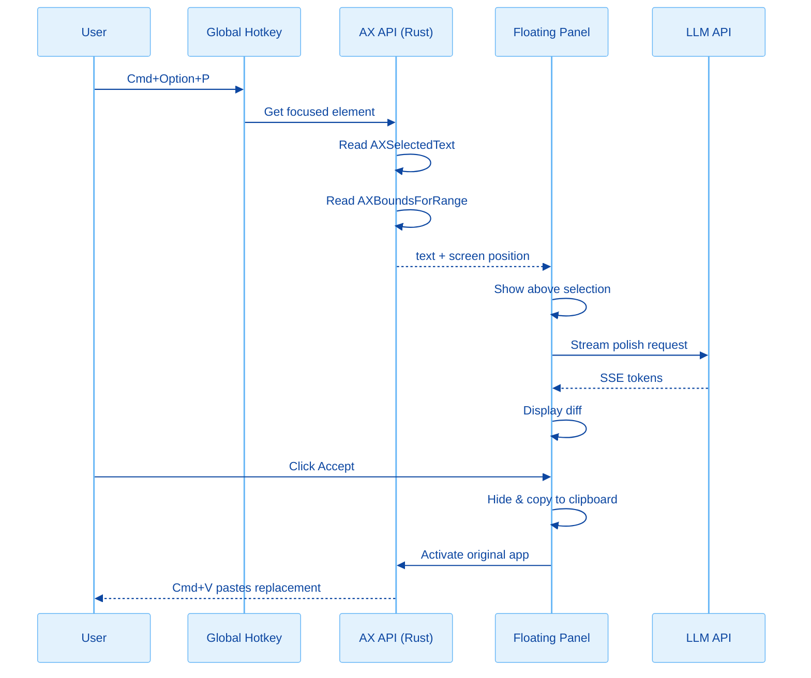
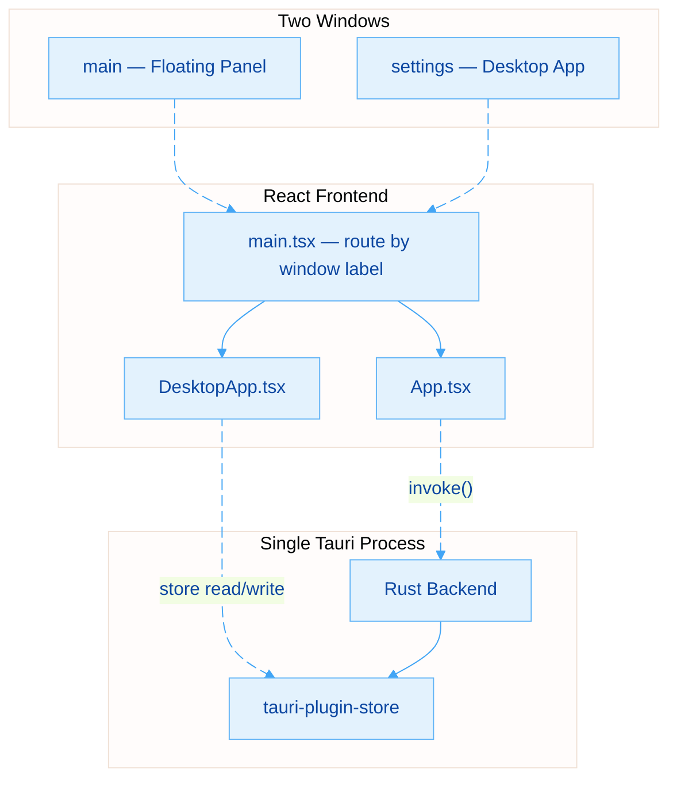

# Polishr

A Grammarly-like desktop app for grammar polishing, rephrasing, and translation. Select text in any app, press a hotkey, and a compact floating panel appears with polished results — accept to replace in-place.

**Features:**
- Improve -- fix grammar, spelling, punctuation (auto-detects language)
- Rephrase -- rewrite with different words and structure (auto-detects language)
- Translate -- Chinese to English or English to Chinese (auto-detects direction)
- System-wide floating panel -- works in any app via global hotkey + macOS Accessibility API
- Inline diff -- green/red highlighting for insertions and deletions
- One-line explanation -- the LLM explains what it changed
- In-place text replacement -- accept to replace via clipboard + paste
- Ask for a change -- type custom instructions to re-polish with specific guidance
- Desktop settings -- configure multiple API providers (OpenAI, DeepSeek, OpenRouter, MiniMax)
- History -- all polishing sessions saved and searchable
- Auto-dismiss -- panel closes when you click away

## Architecture



### Multi-Window Architecture



### Tech Stack

| Layer | Technology |
|-------|-----------|
| Desktop framework | [Tauri v2](https://v2.tauri.app/) (Rust + WebView) |
| Frontend | React 19 + TypeScript |
| Styling | TailwindCSS 4 + custom design tokens |
| Build tool | Vite |
| LLM | OpenAI-compatible API (raw fetch + SSE) |
| Diff | diff-match-patch |
| Language detection | Unicode CJK ratio |
| Text capture | macOS Accessibility API (AXUIElement FFI) |
| Text replace | Clipboard + osascript Cmd+V |

## Local Development

### Prerequisites

- [Node.js](https://nodejs.org/) >= 18
- [pnpm](https://pnpm.io/) >= 9
- [Rust](https://rustup.rs/) >= 1.77
- macOS (Accessibility API is macOS-only for now)

```bash
# Install Rust (if not already installed)
curl --proto '=https' --tlsv1.2 -sSf https://sh.rustup.rs | sh

# Install pnpm (if not already installed)
npm install -g pnpm
```

### Setup

```bash
# Clone the repo
git clone https://github.com/cr7258/polishr.git
cd polishr

# Install dependencies
pnpm install
```

### Development

```bash
# Run the app in dev mode (frontend + Rust hot-reload)
pnpm tauri dev
```

This starts both the Vite dev server (port 1420) and the Tauri native process. Changes to React code hot-reload instantly; changes to Rust code trigger a fast recompile.

### Build

```bash
# Build the production desktop app
pnpm tauri build
```

Output:
- macOS: `.dmg` and `.app` in `src-tauri/target/release/bundle/`

### Configuration

Click the **Polishr tray icon** (menu bar) > **Settings** to open the Desktop settings window.

**API Providers** — Configure one or more LLM providers:

| Provider | Default Endpoint | Default Model |
|----------|-----------------|---------------|
| DeepSeek | `https://api.deepseek.com/v1` | `deepseek-chat` |
| OpenAI | `https://api.openai.com/v1` | `gpt-4o` |
| OpenRouter | `https://openrouter.ai/api/v1` | `openai/gpt-4o` |
| MiniMax | `https://api.minimax.chat/v1` | `abab6.5s-chat` |

**Preferences** — Set default action (Improve/Rephrase/Translate).

### macOS Accessibility Permission

Polishr needs Accessibility access to read selected text in other apps via the AX API. On first use, grant permission in:

**System Settings > Privacy & Security > Accessibility > Enable Polishr**

### Commands Reference

| Command | Description |
|---------|-------------|
| `pnpm tauri dev` | Run app in development mode |
| `pnpm tauri build` | Build production app |
| `pnpm dev` | Run only the Vite frontend dev server |
| `pnpm build` | Build only the frontend |

## Usage

### Floating Panel (Quick Polish)
1. Select text in any app
2. Press `Cmd+Option+P`
3. A floating panel appears above your selection with the polished result and inline diff
4. Review the suggestion, then:
   - **Accept** — replaces the original text in-place
   - **Copy** — copies the polished text to clipboard
   - **Ask for a change** — type custom instructions and re-polish
   - Click away or press **Esc** — auto-dismiss
5. Switch modes via the bottom tab bar: **Improve** / **Rephrase** / **Translate**

### Desktop Settings
- Click the **tray icon** > **Settings** to open
- **Providers** — Add API keys, switch between providers
- **History** — Browse and search past polishing sessions
- **Preferences** — Set default action for the hotkey

## License

MIT
