# Polishr

A desktop app for grammar polishing and translation. Select text in any app, press a hotkey, and replace it with polished results powered by LLM.

**Features:**
- Polish English -- fix grammar, spelling, punctuation, improve clarity
- Polish Chinese -- fix Chinese grammar, remove redundancy, improve expression
- Translate CN to EN -- translate Chinese to natural, polished English
- System-wide text replacement -- works in any app via global hotkey

## Architecture

```mermaid
%%{init: {'theme': 'base', 'themeVariables': {'primaryColor': '#e3f2fd', 'primaryTextColor': '#0d47a1', 'primaryBorderColor': '#64b5f6', 'lineColor': '#42a5f5', 'secondaryColor': '#fce4ec', 'tertiaryColor': '#f3e5f5'}}}%%
flowchart LR
    User("👤 User selects text<br/>in any app"):::userNode
    Hotkey("⌨️ Global Hotkey<br/>Cmd+Option+P"):::hotkeyNode
    Rust("🦀 Tauri Rust Backend<br/>enigo + clipboard"):::rustNode
    React("⚛️ React Frontend<br/>WebView"):::reactNode
    LLM("🤖 OpenAI-Compatible<br/>API"):::llmNode

    User e1@--> Hotkey
    Hotkey e2@--> Rust
    Rust e3@-->|"simulate Cmd+C<br/>read clipboard"| React
    React e4@-->|"stream request"| LLM
    LLM e5@-->|"SSE tokens"| React
    React e6@-->|"polished text"| Rust
    Rust e7@-->|"write clipboard<br/>simulate Cmd+V"| User

    e1@{ animate: true }
    e2@{ animate: true }
    e3@{ animate: true }
    e4@{ animate: true }
    e5@{ animate: true }
    e6@{ animate: true }
    e7@{ animate: true }

    classDef userNode fill:#e8f5e9,stroke:#66bb6a,stroke-width:2px,color:#1b5e20
    classDef hotkeyNode fill:#fff3e0,stroke:#ffb74d,stroke-width:2px,color:#e65100
    classDef rustNode fill:#fce4ec,stroke:#f06292,stroke-width:2px,color:#880e4f
    classDef reactNode fill:#e3f2fd,stroke:#64b5f6,stroke-width:2px,color:#0d47a1
    classDef llmNode fill:#f3e5f5,stroke:#ce93d8,stroke-width:2px,color:#4a148c
```



### Project Structure

```mermaid
%%{init: {'theme': 'base', 'themeVariables': {'primaryColor': '#e3f2fd', 'primaryTextColor': '#0d47a1', 'primaryBorderColor': '#64b5f6', 'lineColor': '#42a5f5', 'secondaryColor': '#fce4ec', 'tertiaryColor': '#f3e5f5'}}}%%
flowchart TB
    subgraph frontend ["src/ — React Frontend"]
        components["components/ — React UI"]:::reactNode
        hooks["hooks/ — usePolish, useSettings"]:::hookNode
    end

    subgraph core ["core/ — Pure TS, zero React deps"]
        llm["llm/ — Streaming client"]:::coreNode
        prompts["prompts/ — EN, ZH, Translate"]:::coreNode
        diff["diff/ — diff-match-patch"]:::coreNode
    end

    subgraph backend ["src-tauri/ — Rust Backend"]
        commands["commands.rs — capture & replace"]:::rustNode
        tray["tray.rs — System tray"]:::rustNode
        lib["lib.rs — Plugin init"]:::rustNode
    end

    OS["OS Keyboard + Clipboard"]:::osNode

    components e1@--> hooks
    hooks e2@--> core
    hooks e3@-->|"invoke()"| commands
    commands e4@-->|"enigo"| OS

    e1@{ animate: true }
    e2@{ animate: true }
    e3@{ animate: true, animation: slow }
    e4@{ animate: true, animation: slow }

    classDef reactNode fill:#e3f2fd,stroke:#64b5f6,stroke-width:2px,color:#0d47a1
    classDef hookNode fill:#fff3e0,stroke:#ffb74d,stroke-width:2px,color:#e65100
    classDef coreNode fill:#e8f5e9,stroke:#66bb6a,stroke-width:2px,color:#1b5e20
    classDef rustNode fill:#fce4ec,stroke:#f06292,stroke-width:2px,color:#880e4f
    classDef osNode fill:#f3e5f5,stroke:#ce93d8,stroke-width:2px,color:#4a148c
```



### Tech Stack

| Layer | Technology |
|-------|-----------|
| Desktop framework | [Tauri v2](https://v2.tauri.app/) (Rust + WebView) |
| Frontend | React 19 + TypeScript |
| Styling | TailwindCSS 4 + custom design tokens |
| Build tool | Vite |
| LLM | OpenAI-compatible API (raw fetch + SSE) |
| Diff | diff-match-patch |
| Keyboard sim | enigo (Rust crate) |

## Local Development

### Prerequisites

- [Node.js](https://nodejs.org/) >= 18
- [pnpm](https://pnpm.io/) >= 9
- [Rust](https://rustup.rs/) >= 1.77
- macOS / Windows / Linux

```bash
# Install Rust (if not already installed)
curl --proto '=https' --tlsv1.2 -sSf https://sh.rustup.rs | sh

# Install pnpm (if not already installed)
npm install -g pnpm
```

### Setup

```bash
# Clone the repo
git clone https://github.com/cr7258/polishr.git
cd polishr

# Install dependencies
pnpm install
```

### Development

```bash
# Run the app in dev mode (frontend + Rust hot-reload)
pnpm tauri dev
```

This starts both the Vite dev server (port 1420) and the Tauri native process. Changes to React code hot-reload instantly; changes to Rust code trigger a fast recompile.

### Build

```bash
# Build the production desktop app
pnpm tauri build
```

Output:
- macOS: `.dmg` and `.app` in `src-tauri/target/release/bundle/`
- Windows: `.msi` and `.exe`
- Linux: `.deb` and `.AppImage`

### Configuration

On first launch, open Settings (gear icon in the title bar) and configure:

| Setting | Description | Example |
|---------|-------------|---------|
| API Endpoint | OpenAI-compatible base URL | `https://api.openai.com/v1` |
| API Key | Your API key | `sk-...` |
| Model | Model name | `gpt-4o`, `deepseek-chat` |
| Temperature | Output creativity (0-1) | `0.3` (recommended) |

Preset endpoints: **OpenAI**, **DeepSeek**, **Ollama** (local).

### macOS Accessibility Permission

Polishr needs Accessibility access to simulate keyboard shortcuts (`Cmd+C` / `Cmd+V`) for the system-wide replace feature. On first use, grant permission in:

**System Settings > Privacy & Security > Accessibility > Enable Polishr**

### Commands Reference

| Command | Description |
|---------|-------------|
| `pnpm tauri dev` | Run app in development mode |
| `pnpm tauri build` | Build production app |
| `pnpm dev` | Run only the Vite frontend dev server |
| `pnpm build` | Build only the frontend |

## Usage

1. **Direct editing**: Open Polishr, paste text, select a mode, click Polish
2. **System-wide replace**: Select text in any app, press `Cmd+Option+P`, review the diff, click Replace

## License

MIT
