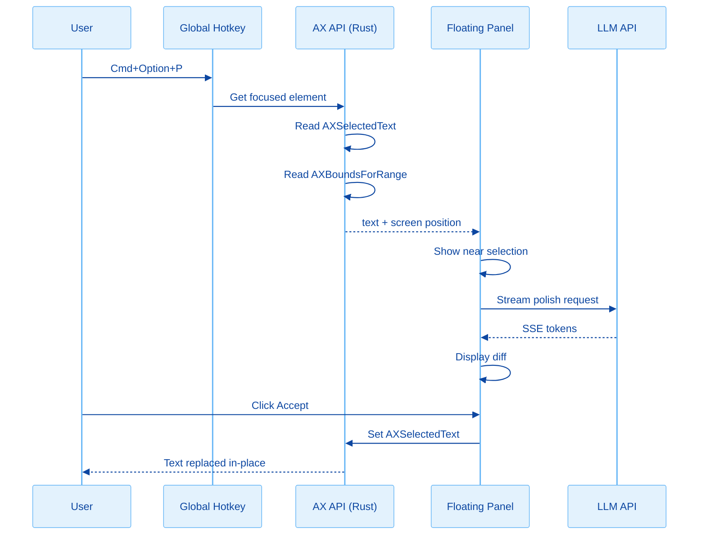
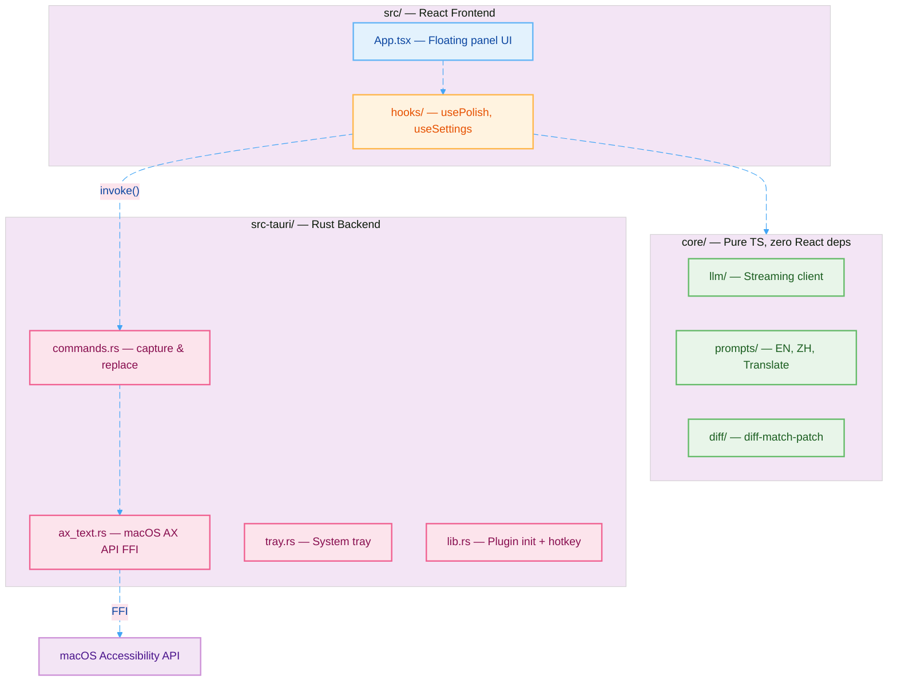

# Polishr

A Grammarly-like desktop app for grammar polishing and translation. Select text in any app, press a hotkey, and a compact floating panel appears with polished results — accept to replace in-place.

**Features:**
- Polish English -- fix grammar, spelling, punctuation, improve clarity
- Polish Chinese -- fix Chinese grammar, remove redundancy, improve expression
- Translate CN to EN -- translate Chinese to natural, polished English
- System-wide floating panel -- works in any app via global hotkey + macOS Accessibility API
- Direct text replacement -- no clipboard manipulation, text is read/written via AX API

## Architecture



### Project Structure



### Tech Stack

| Layer | Technology |
|-------|-----------|
| Desktop framework | [Tauri v2](https://v2.tauri.app/) (Rust + WebView) |
| Frontend | React 19 + TypeScript |
| Styling | TailwindCSS 4 + custom design tokens |
| Build tool | Vite |
| LLM | OpenAI-compatible API (raw fetch + SSE) |
| Diff | diff-match-patch |
| Text access | macOS Accessibility API (AXUIElement FFI) |

## Local Development

### Prerequisites

- [Node.js](https://nodejs.org/) >= 18
- [pnpm](https://pnpm.io/) >= 9
- [Rust](https://rustup.rs/) >= 1.77
- macOS (Accessibility API is macOS-only for now)

```bash
# Install Rust (if not already installed)
curl --proto '=https' --tlsv1.2 -sSf https://sh.rustup.rs | sh

# Install pnpm (if not already installed)
npm install -g pnpm
```

### Setup

```bash
# Clone the repo
git clone https://github.com/cr7258/polishr.git
cd polishr

# Install dependencies
pnpm install
```

### Development

```bash
# Run the app in dev mode (frontend + Rust hot-reload)
pnpm tauri dev
```

This starts both the Vite dev server (port 1420) and the Tauri native process. Changes to React code hot-reload instantly; changes to Rust code trigger a fast recompile.

### Build

```bash
# Build the production desktop app
pnpm tauri build
```

Output:
- macOS: `.dmg` and `.app` in `src-tauri/target/release/bundle/`

### Configuration

On first launch, open Settings (gear icon in the floating panel) and configure:

| Setting | Description | Example |
|---------|-------------|---------|
| API Endpoint | OpenAI-compatible base URL | `https://api.openai.com/v1` |
| API Key | Your API key | `sk-...` |
| Model | Model name | `gpt-4o`, `deepseek-chat` |
| Temperature | Output creativity (0-1) | `0.3` (recommended) |

Preset endpoints: **OpenAI**, **DeepSeek**, **Ollama** (local).

### macOS Accessibility Permission

Polishr needs Accessibility access to read and write selected text in other apps via the AX API. On first use, grant permission in:

**System Settings > Privacy & Security > Accessibility > Enable Polishr**

### Commands Reference

| Command | Description |
|---------|-------------|
| `pnpm tauri dev` | Run app in development mode |
| `pnpm tauri build` | Build production app |
| `pnpm dev` | Run only the Vite frontend dev server |
| `pnpm build` | Build only the frontend |

## Usage

1. Select text in any app
2. Press `Cmd+Option+P`
3. A floating panel appears near your selection with the polished result
4. Click **Accept** to replace the text in-place, or **Dismiss** to close

## License

MIT
